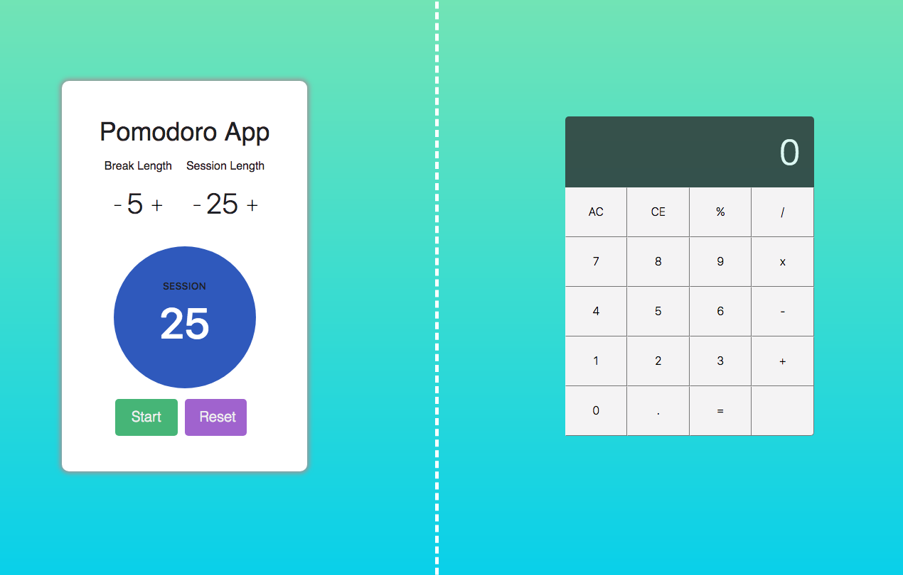
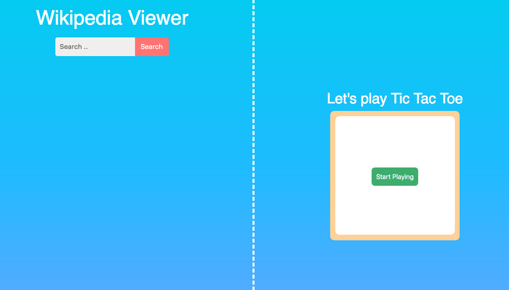

# FREE CODE CAMP FRONT END APPS

Here are some of the projects from the free code camp front end curriculum. The projects include the pomodoro clock, calculator, wiki search, and tic tac toe.
 
All projects were build using JQuery except for the tic tac toe game which was built using Vanilla JS. 
 

#Website Images

